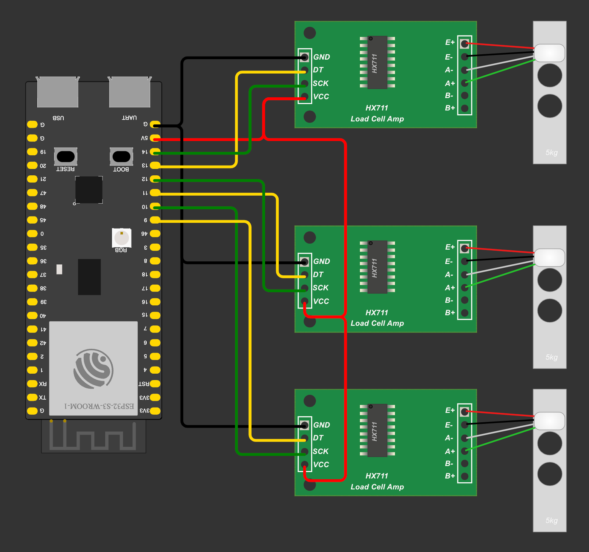
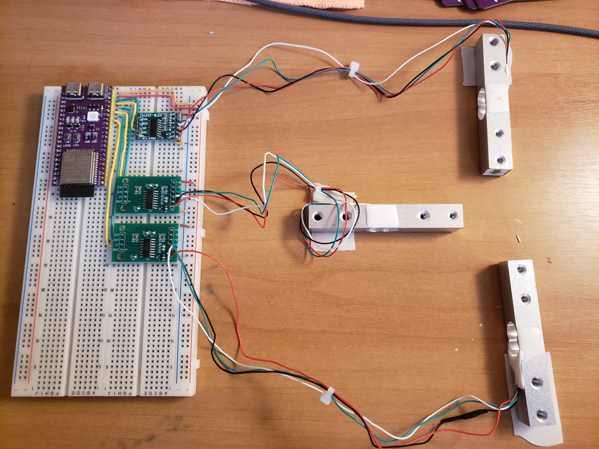
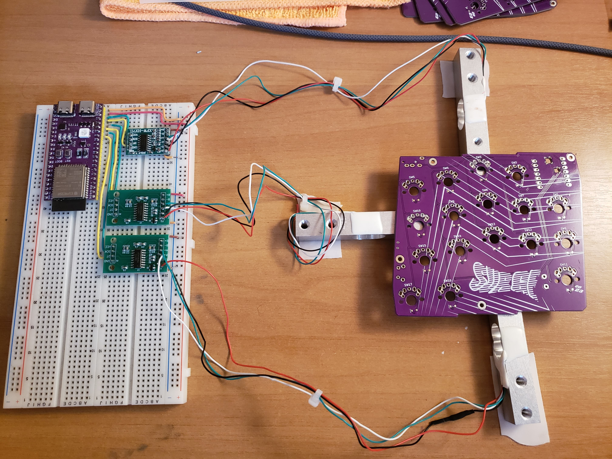
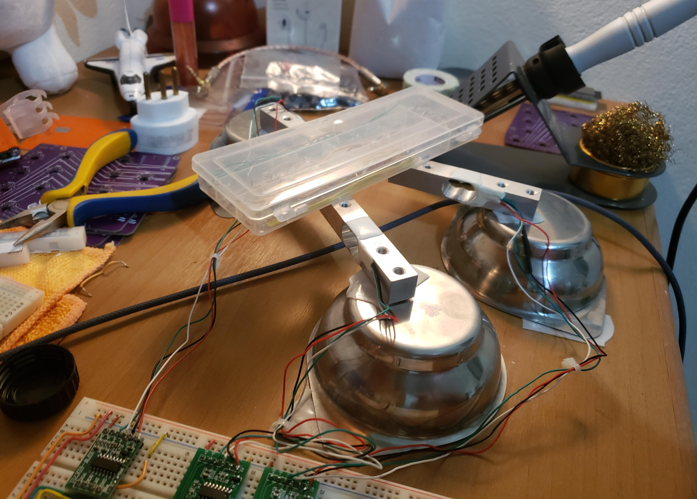
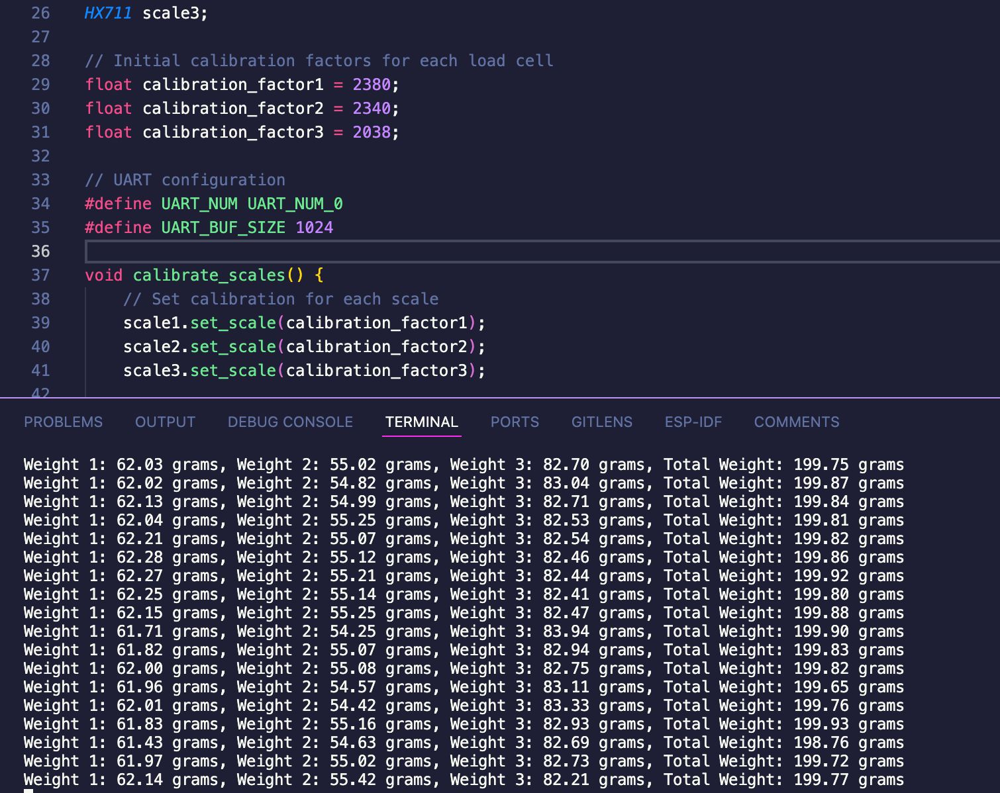

## Overview

This document provides an in-depth explanation of the load cell and HX711 amplifier setup used in the Kaishita vending machine project. The load cell, paired with the HX711 module, enables precise measurement of item weights, facilitating product detection and inventory management.

---

## Components

### 1. Load Cell

- **Function**: Measures the weight of objects by generating a small, variable electrical signal based on the applied force.

- **Wheatstone Bridge Configuration**: The load cell operates using a Wheatstone bridge with four strain gauges, which convert mechanical deformation (weight) into a minute electrical voltage, enabling precise weight detection.

<div align="center">
    
    
    
</div>

- **Integration Progress**: Initial tests confirm consistent readings from the load cell, and calibration has been conducted for the expected weight range of typical vending machine items.

### 2. HX711 (ADC and Amplifier)

- **Purpose**: The HX711 is a 24-bit analog-to-digital converter (ADC) with a built-in amplifier that reads the small voltage from the load cell and converts it into digital signals.

- **Amplification**: The HX711 amplifies the low-voltage signal from the load cell, allowing the system to capture minute weight changes.

- **Digital Output**: The HX711’s ADC translates the analog signal into digital data, enabling easy integration with the vending machine software for weight processing.

### 3. ESP32-S3 (Microcontroller)

- **Microcontroller Choice**: The ESP32-S3 was selected for its availability, dual-core processing power, and AI capabilities, which may prove useful for future features such as real-time analysis and enhanced machine learning functions.

Note: The ESP32-S3 also offers advanced processing potential in concurrent tasks. This project utilizes the ESP-IDF extension for VSCode, chosen for its balance of control and lower abstraction compared to other platforms like PlatformIO or Arduino IDE.

---

## Setup and Current Status

- **Electrical Connections**: The load cell’s Wheatstone bridge output connects to the HX711’s input, and the HX711 transmits digital weight data to the ESP32-S3 microcontroller.

<div align="center">
    
</div>

- **Calibration**: Calibration steps have been carried out to ensure accuracy based on product weight ranges.

- **Data Testing and Validation**: Initial tests have validated data reliability, and the setup is currently delivering stable weight measurements with minimal error.

<div align="center">
    
    
    
</div>

---

## Results

<div align="center">
    
</div>

---

## MQTT Communication

The vending machine's weight data is published using MQTT communication, following the **Publisher -> Broker -> Subscriber** model:

<div align="center">
    
</div>

- **Publisher**: The ESP32 firmware publishes the measured weight in grams as a string.
- **Broker**: The MQTT broker facilitates communication between the ESP32 and the subscriber.
- **Subscriber**: The server or any client subscribes to the topic to receive and process the weight data.

### **FreeRTOS Task Implementation**
To manage the publishing process efficiently, the project uses FreeRTOS to handle concurrent tasks on the ESP32-S3. The weight data is sent periodically via MQTT:

```cpp
xTaskCreate([](void*) {
    while (true) {
        publishWeight();
        vTaskDelay(200 / portTICK_PERIOD_MS); // Publish every 200 ms
    }
}, "MQTT Publish Task", 4096, NULL, 1, NULL);
```

- **Task Details**:
  - `publishWeight()` sends the current weight as a string to the MQTT broker.
  - The task runs with a delay of **200 milliseconds**, enabling rapid and reliable data transmission without overloading the system.

---

## Next Steps

- **3D Printed Structure**: To improve measurement accuracy and balance, a custom 3D-printed base will be developed for housing three load cells. This will support better calibration and stability in readings.

- **Improved Calibration**: After assembling the enhanced structure, calibration will be refined to account for the three-cell setup, further enhancing accuracy.

- **Firmware Enhancements**: The next steps involve fine-tuning the firmware to manage threshold-based item verification and optimize stabilization algorithms to achieve rapid, reliable weight measurements.

---
