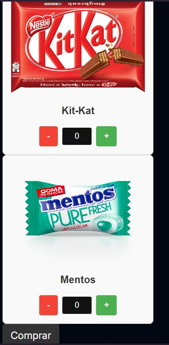

_On the mission to develop affordable, small and custumizable vending machines to everyone._

### Kashita is a student-lead project born at USP São Carlos - Brazil.


Here is a more detailled look into what our goals are:
- Bring automated sales solutions that can fit anywhere
- Crete a purchasing solution as easy as just grabbing the product with your hand (without theft, of course)
- Increase the security of unsupervised sales
- Deliver more payement methods options for the consumers (Pix, credit/debit cards, etc)
- Give feedback to the salesman, with stock management and pricing (AI alert!)

If you want to collaborate, just grab an issue and hop on the project!


# **Kaishita: Affordable and Customizable Vending Machines**

---

## **Project Overview**

_On the mission to develop affordable, small, and customizable vending machines for everyone._

### **About Kaishita**
Kaishita is a student-led project born at **USP São Carlos, Brazil**, aiming to revolutionize automated sales systems with compact and intelligent vending machines.

<div align="center">
    
</div>

---

## **Goals**
- Deliver **automated sales solutions** that fit any environment.
- Create a purchasing process as simple as **grabbing the product** (secure and theft-proof).
- Offer **diverse payment methods** like Pix and credit/debit cards.
- Provide **real-time feedback** to vendors, including stock management and AI-based pricing suggestions.

---

## **How It Works**
The Kaishita vending machine integrates **weight sensors**, **MQTT communication**, and a centralized server to automate and analyze purchases.

### **Action Flow**
1. **User Interaction**:  
   The user selects the desired product and quantity to withdraw from the vending machine.  
2. **Server Logic**:  
   The server receives the request, monitors the event, and determines the state of the purchase:
   - **Candies Taken** (Successful)
   - **Candies Not Taken** (Unsuccessful)
3. **Weight Verification**:  
   The ESP32 weight system ensures the correct amount of product has been taken.  
4. **Data Analysis**:  
   Every successful purchase is logged in a **CSV file** and automatically analyzed for trends.

---

## **Table of Contents**

1. [Overview](#overview)
2. [Project Structure](#project-structure)
3. [Features](#features)
4. [Hardware Requirements](#hardware-requirements)
5. [Setup Instructions](#setup-instructions)
6. [How It Works](#how-it-works)
7. [ESP32 Task Management with FreeRTOS](#esp32-task-management-with-freertos)
8. [Arduino Component Integration](#arduino-component-integration)
9. [MQTT Topics and Payloads](#mqtt-topics-and-payloads)
10. [Next Steps](#next-steps)
11. [Development Environment](#development-environment)
12. [Credits](#credits)

---

## **Project Structure**

```
Kaishita/
├── Hardware_Firmware/      # ESP32 firmware code for the vending machine
│   ├── components/         # External libraries and components
│   │   ├── arduino/        # Arduino libraries for ESP-IDF compatibility
│   │       ├── pubsubclient/   # MQTT library
│   │   ├── WiFiManager/    # Wi-Fi management library
│   ├── include/            # Header files for MQTT and weight logic
│   ├── main/               # Main source code
│   │   ├── 3Cell.cpp       # Weight scale logic (HX711 integration)
│   │   ├── mqtt.cpp        # MQTT communication
│   │   ├── main.cpp        # Firmware entry point
│   ├── CMakeLists.txt      # Build configuration
│
├── Website/                # Server code (handles vending machine communication)
│   ├── requirements.txt    # Add coment here (3 ~ 4 words)
│   ├── site.py             # Add coment here (3 ~ 4 words)
│
├── Analysis/               # Automated purchase data analysis
│   ├── analise_compras.py  # Script for trend analysis
│   ├── requirements.txt    # Python dependencies
│   └── README.md           # Instructions for running analysis
│
└── README.md               # Main project documentation
```

---

## **Key Features**

### **1. IoT Weight System**
- Monitors the weight of products using **HX711 load cells** connected to an ESP32-S3.
- Publishes weight data to a server via **MQTT** for purchase verification.

### **2. Server Integration**
- Handles user requests, verifies events, and tracks product states:
  - **Product Taken**  
  - **Product Not Taken**

### **3. Data Analysis**
- Logs successful purchases into a **CSV file**.
- Automatically generates:
  - **Trend graphs**: Showing product purchases over time.
  - **Purchase probabilities**: Calculating likelihood of sales at specific times (morning, afternoon, evening).

---

## **Setup Instructions**

### **ESP32 Firmware**

1. Clone the repository:
   ```bash
   git clone https://github.com/GUUDIN/Kaishita.git
   cd Kaishita/Hardware_Firmware/src
   ```

2. Install Arduino Component:
   ```bash
   git submodule add https://github.com/espressif/arduino-esp32.git components/arduino
   cd components/arduino
   git submodule update --init --recursive
   ```

3. Add Required Libraries:
   ```bash
   idf.py add-dependency "tzapu/WiFiManager"
   idf.py add-dependency "knolleary/pubsubclient"
   ```

4. Configure Wi-Fi and MQTT Broker in `main/mqtt.cpp`:
   ```cpp
   const char* mqtt_server = "YOUR_MQTT_BROKER_ADDRESS";
   const int mqtt_port = YOUR_MQTT_BROKER_PORT;
   ```

5. Build and Flash Firmware:
   ```bash
   idf.py build
   idf.py flash
   ```

---

### **Analysis Script Setup**

1. Navigate to the `analysis` folder:
   ```bash
   cd Kaishita/analysis
   ```

2. Install Dependencies in a Virtual Environment:
   ```bash
   python3 -m venv venv
   source venv/bin/activate   # Linux/MacOS
   pip install -r requirements.txt
   ```

3. Run the Analysis:
   ```bash
   python analise_compras.py
   ```

4. Provide the CSV file path when prompted.

---

## **Example CSV File Format**

| data       | hora | produto   | quantidade |
|------------|------|-----------|------------|
| 2024-01-01 | 8    | KitKat    | 10         |
| 2024-01-01 | 14   | Mentos    | 5          |
| 2024-01-01 | 20   | Bala      | 7          |

---

## **Results**
1. **Trend Graphs**: Visualize total quantities of products sold at different times.
2. **Purchase Probabilities**: Calculate product popularity in the morning, afternoon, and evening.

---

## **See the current state of the project!**

### **Website UI**
<details>
<summary>Click to view Website UI</summary>

</details>

### **Serial Monitor Output**
<details>
<summary>Click to view Serial Monitor Output</summary>

</details>

### **Project Setup**
<details>
<summary>Click to view Project Setup</summary>

</details>

---

## **Contribute to the Project**
If you want to collaborate:
1. Fork the repository.
2. Grab an issue and start coding!
3. Submit a pull request.

---

## **Credits**
- **ESP32 Firmware Development**: Pedro Gudin & Mateus Messias  
- **Analysis and Server Integration**: Mateus Messias & André Messias
- **Documentation**: Pedro Gudin & Mateus Messias & João Breches

---

